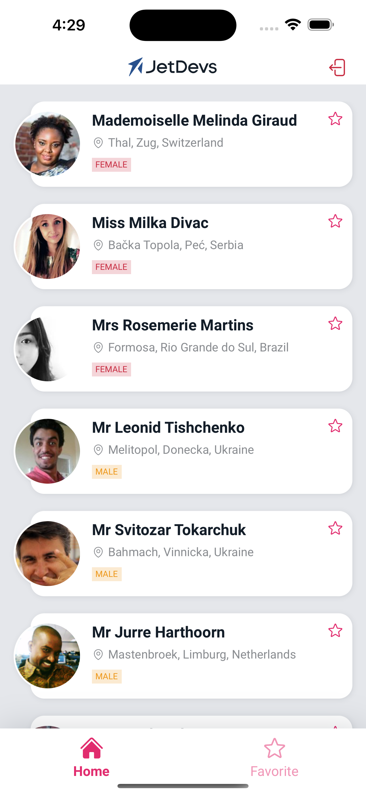
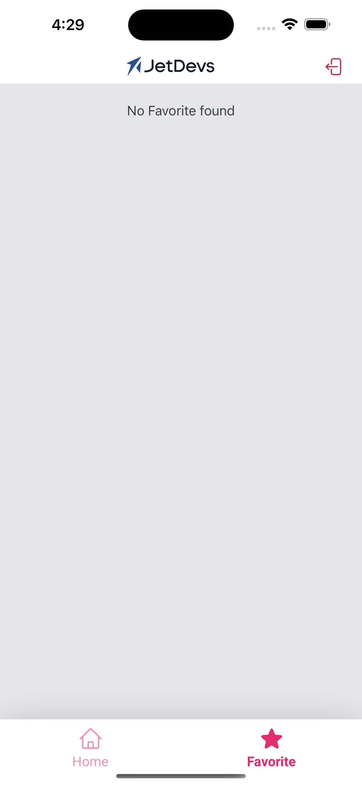
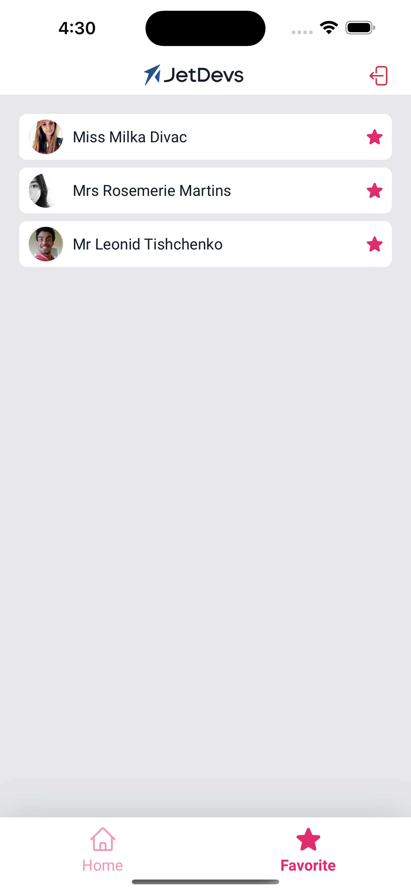
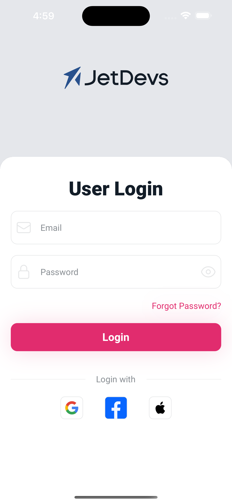

# JetDevs

### Description

This project is a Auth + Dashboard (Home/Favorite tabs): Fetches users, fav/unfav, Redux, React Hooks, TypeScript, API.

### Installation

#### Prerequisites

- Node.js (Version X.X.X or higher)
- npm (Version X.X.X or higher)
- Expo CLI (if applicable)

#### Steps

1. **Clone the repository:**

   ```bash
    git clone https://github.com/your/repository.git
    cd project-directory
   ```

2. **Install dependencies:**

   ```bash
   npm install
   ```

3. **Run the project:**

   - **Expo Managed Workflow:**

     ```bash
     npm start
     ```

     Follow the instructions in the terminal or in the Expo DevTools to open the project on an emulator/device.

   - **React Native CLI (bare workflow):**

     Ensure you have set up your environment as per React Native CLI documentation. Then, run:

     ```bash
     npx react-native run-android
     # or
     npx react-native run-ios
     ```

### Screenshots/GIFs






- Favorite/Unfavorite feature in action
- Other relevant features

### Contributing

If you want to contribute to this project and make it better, your help is very welcome.

### License

This project is licensed under the MIT License.